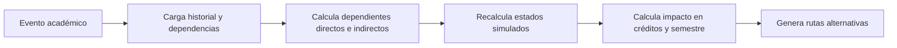

# Arquitectura backend — CurriculaPath

## Decisión de stack

El backend se implementa como un servicio modular en **FastAPI + Python** porque el proyecto no solo necesita API REST, sino también:

- motor de simulación académica,
- procesamiento de PDF,
- OCR local,
- recuperación de contexto para RAG,
- integración opcional con LLM local.

## Estructura

```text
backend/
  app/
    api/
      routes/
    core/
    db/
    models/
    schemas/
    services/
    seeds/
  alembic/
  tests/
```

## Capas

| Capa | Responsabilidad |
| --- | --- |
| `api/routes` | Contrato HTTP y validación de entrada |
| `schemas` | DTOs de request/response |
| `services` | Reglas de negocio |
| `models` | Entidades persistidas |
| `db` | Sesiones, metadata y bootstrap |
| `alembic` | Migraciones |
| `seeds` | Datos iniciales reproducibles |

## Módulos activos

- `auth`
- `programs`
- `courses`
- `curriculums`
- `students`
- `simulation`
- `scenarios`
- `admin`
- `pdf_ingestion`
- `rag_chat`

`pdf_ingestion` ya realiza extracción local de texto, revisión humana y persistencia del grafo. `rag_chat` ya recupera contexto real desde grafo, historial, escenarios y chunks de documentos; además puede delegar la generación a un LLM local cuando exista servidor disponible y hacer fallback seguro cuando no lo haya.

## Flujo principal de simulación



## Decisiones importantes

1. Se usa SQLite por defecto para desarrollo local sin infraestructura adicional.
2. La conexión de base de datos está abstraída por SQLAlchemy, por lo que PostgreSQL puede adoptarse después sin rehacer dominio ni rutas.
3. La API devuelve claves camelCase para mantener compatibilidad con el frontend ya construido.
4. La validación de prerrequisitos se aplica en backend al marcar una materia como aprobada.
5. PDF/OCR y RAG se incorporan sobre módulos separados, no dentro del motor de simulación.
6. Las mutaciones de programas, materias, versiones y dependencias exigen rol administrador y registran actividad persistida para trazabilidad.
7. Las dependencias administrativas se validan contra duplicados, cruces entre versiones y ciclos de prerrequisitos.
8. Los datos académicos sensibles se protegen por rol y pertenencia: el estudiante consulta/modifica solo su información, el asesor obtiene lectura transversal y el administrador conserva acceso operativo.


## Seguridad y operaci?n

El backend incorpora una capa m?nima de operaci?n para que el proyecto pueda pasar de demo local a publicaci?n controlada sin rehacer arquitectura:

- validaci?n de configuraci?n insegura cuando `ENVIRONMENT=production`,
- JWT con expiraci?n, `iat`, `jti` y tipo de token,
- rechazo de usuarios inactivos incluso si conservan un token previo,
- headers de seguridad por middleware,
- Trusted Host configurable,
- redirecci?n HTTPS/HSTS configurable,
- rate limit local configurable,
- `/health` para liveness,
- `/ready` para verificar conectividad de base de datos.

La gu?a operativa completa est? en `docs/SECURITY_AND_OPERATIONS.md`.
