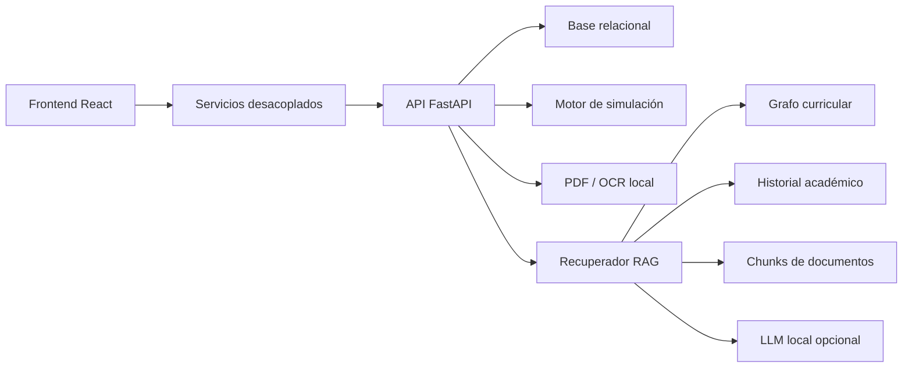

# Guía de sustentación — CurriculaPath

Esta guía está pensada para presentar el proyecto como un sistema completo, no como pantallas sueltas. La idea es mostrar valor académico, arquitectura y respuesta directa a los comentarios del profesor.

## Apertura sugerida

> CurriculaPath es un simulador dinámico de malla curricular. Permite que un estudiante visualice su plan académico como grafo, entienda prerrequisitos, simule pérdida, cancelación o aplazamiento de materias, compare rutas alternativas y consulte un chat académico con recuperación de contexto. Además, incluye administración de mallas, carga de PDFs y conversión validada hacia grafo.

## Historia de demo en 12 minutos

### 1. Estado del sistema

Abre primero el diagnóstico:

```bash
npm run doctor
```

Mensaje a decir:

> Antes de mostrar la aplicación, validamos entorno, dependencias, backend, OCR, PDFs de prueba y puertos. Esto evita que la demo dependa de suerte local.

### 2. Estudiante

Usuario:

- `estudiante@curriculapath.edu`
- `demo123`

Recorrido:

1. Dashboard: progreso, créditos, alertas y materias disponibles.
2. Malla curricular: grafo interactivo, estados por color y detalle de materia.
3. Simulación: pérdida de Programación II y bloqueo en cascada.
4. Rutas alternativas: acelerada, balanceada y pausada.
5. Comparación: contraste de dos escenarios.
6. Chat académico: pregunta “¿Qué pasa si pierdo Programación II?”.

Mensaje a decir:

> El valor principal no es solo ver materias, sino anticipar consecuencias académicas antes de tomar una decisión.

### 3. Administrador

Usuario:

- `admin@curriculapath.edu`
- `demo123`

Recorrido:

1. Panel de administración.
2. Pestaña Estado sistema.
3. Gestión de usuarios, programas, materias, versiones y dependencias.
4. Carga PDF.
5. Procesar PDF con texto.
6. Revisar materias/dependencias detectadas.
7. Aprobar grafo.

Mensaje a decir:

> El administrador no solo carga información manualmente: puede partir de un PDF de malla, procesarlo, revisar los hallazgos y guardar el resultado como grafo validado.

### 4. Asesor académico

Usuario:

- `asesor@curriculapath.edu`
- `demo123`

Recorrido:

1. Buscar estudiante.
2. Ver avance solo lectura.
3. Revisar escenarios guardados.
4. Usar la información para apoyar una asesoría.

Mensaje a decir:

> La vista del asesor transforma el simulador en una herramienta de acompañamiento, no solo en una app individual del estudiante.

## Cómo responder a los comentarios del profesor

### Comentario: “El sistema debe permitir cargar PDF, procesar texto o imagen y guardar el resultado en el grafo.”

Respuesta:

> Ya existe el flujo de carga PDF. El backend extrae texto nativo con PyMuPDF, intenta OCR local cuando el PDF parece imagen, detecta materias y dependencias, muestra diagnósticos y exige revisión manual antes de guardar en la malla. El guardado valida códigos duplicados, materias sin código, dependencias inválidas, autorreferencias y ciclos.

Evidencia:

- Ruta: `/admin/cargar-pdf`
- Backend: `POST /api/v1/admin/curriculum-documents/:id/process`
- Guardado: `POST /api/v1/admin/curriculum-documents/:id/approve-graph`

### Comentario: “Debe tener un chat con lenguaje natural usando LLM local y RAG.”

Respuesta:

> El chat ya recupera contexto real desde grafo curricular, historial académico, escenarios guardados y documentos procesados. El LLM local es opcional y configurable: soporta Ollama y servidores compatibles con OpenAI como LM Studio o llama.cpp. Si no hay modelo local disponible, usa fallback controlado para que el sistema siga funcionando sin mentir que hay IA real conectada.

Evidencia:

- Ruta: `/chat`
- Diagnóstico: `/configuracion`
- Endpoints: `/api/v1/rag/retrieve`, `/api/v1/llm/connect`, `/api/v1/llm/generate`

## Arquitectura para explicar



Idea clave:

> La interfaz consume servicios, no datos pegados. Por eso el sistema pudo crecer de mock a backend real sin rehacer las pantallas.

## Preguntas difíciles y respuestas cortas

### ¿Esto ya es producción?

No todavía. Es un sistema fullstack demostrable. Para producción faltan HTTPS definitivo, monitoreo, backups, base administrada y política institucional de usuarios.

### ¿El OCR usa servicios cloud?

No. Está preparado para OCR local con Tesseract. Los PDFs con texto nativo se procesan sin OCR.

### ¿El chat usa una API paga?

No. El diseño apunta a LLM local. Soporta Ollama y servidores OpenAI-compatible locales. Si no hay modelo corriendo, usa fallback controlado.

### ¿Cómo se evita que una malla mal extraída dañe el grafo?

El grafo no se guarda automáticamente. Primero pasa por validación manual y luego el backend valida duplicados, referencias inválidas y ciclos.

### ¿Qué pasa si un estudiante cambia de programa?

El perfil permite seleccionar programa principal y segundo programa. La lógica de grafo, avance y RAG usa el programa principal activo del estudiante.

## Lo que conviene no decir

- No digas “la IA real está implementada” si no hay modelo local conectado.
- No digas “OCR siempre funciona”; explica que depende del PDF y del motor local.
- No presentes SQLite como solución final para muchos usuarios concurrentes.
- No muestres primero un PDF escaneado si Tesseract no está instalado; empieza con el PDF de texto y luego muestra el diagnóstico OCR.

## Cierre sugerido

> CurriculaPath integra planeación académica, simulación sobre grafos, administración de mallas, procesamiento de PDFs y chat RAG en una arquitectura preparada para crecer. Lo importante es que las piezas críticas ya están conectadas por servicios y contratos claros, de modo que el proyecto puede evolucionar a producción sin rehacer la experiencia principal.
